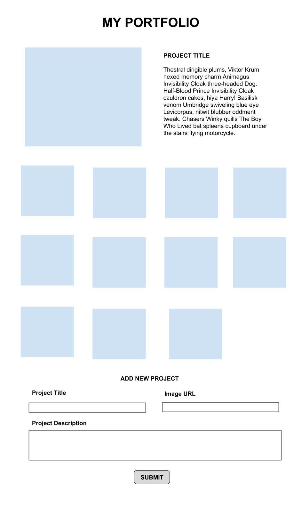

# Maninpulación del DOM con JavaScript

En este repositorio crearás un portafolio manipulando el DOM directamente.

## Objetivos

- Manipular el DOM directamente añadiendo y eliminando elementos.
- Usar CSS para añadir estilo a los elementos de la página.
- Agregar _event handlers_ para interactuar con las acciones del usuario en la página.

## Configuración

Abre `index.html` en el navegador.

## Requisitos básicos

_Nota: ¡No uses jQuery en ningún ejercicio! El propósito de la actividad es que te sientas a gusto manipulando el DOM usando simplemente JavaScript._

### 1. Crea un formulario que añada imágenes en la página.

- [ ] Añade funcionalidad.
  - Este formulario debería recibir una URL.
  - Este formulario debería tener botón de "submit".
  - Después de hacer click en el botón, la imagen de la URL debería aparecer en la parte superior de la página.
- [ ] Añade estilo.
  - Todo debería estar alineado al centro.
  - Las imágenes deben estar posicionadas en un patrón cuadriculado (_grid_) de modo que aparezcan de cuatro en cuatro. Esto lo puedes lograr usando simplemente CSS o también puedes usar la librería Bootstrap si la conoces.

### 2. Añade campos adicionales al formulario.

- [ ] Añade funcionalidad.
  - Crea un cuadro de texto para el título del proyecto.
  - Agrega un cuadro de texto más grande (busca `textarea`) para la descripción del proyecto.
  - Esta información se debe almacenar en algún lugar, pero sin mostrarla aún. Pista: crea las variables que necesites para almacenar la información de todos los proyectos (el título, la descripción y la imagen).
- [ ] Añade estilo.
  - Consulta la vista previa – el título y la imagen estan en la misma línea y la descripción del proyecto tiene su propia línea.

### 3. Crea una sección para una imagen destacada

- [ ] Añade funcionalidad
  - Si aún no hay imágenes en la página, no debería mostrarse nada.
  - Al hacer click en cualquier imagen, se debería remplazar la imagen destacada con la imagen en la que se hizo click.
- [ ] Añada estilo.
  - La imagen destacada debe aparecer a la izquierda y el título y la descripción a la derecha.

### 4. Mejora el estilo

- [ ] ¡Juega con el estilo para que parezca lo más profesional posible!

## Recursos

- [MDN - Manipulating the DOM Guide](https://developer.mozilla.org/en-US/docs/Learn/JavaScript/Client-side_web_APIs/Manipulating_documents)
- [Plain JS - Common DOM Manipulation methods](https://plainjs.com/javascript/manipulation/)
- [Eloquent JavaScript - The DOM](https://eloquentjavascript.net/14_dom.html)
- [Eloquent JavaScript - Handling Events](https://eloquentjavascript.net/15_event.html)

## Notas

_Este es un proyecto de estudiante creado en [CodeOp](http://CodeOp.tech), un bootcamp de desarrollo full stack en Barcelona._
